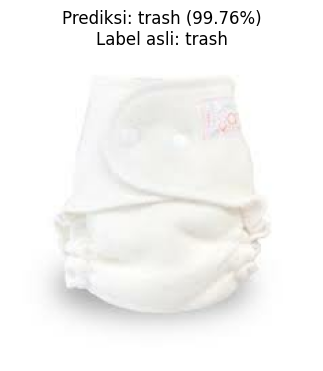

# Garbage Classification with EfficientNetB0

Repositori ini berisi proyek klasifikasi gambar sampah rumah tangga menggunakan **TensorFlow/Keras** dan **transfer learning EfficientNetB0**. Model dilatih untuk mengenali 12 kelas sampah seperti `battery`, `biological`, `cardboard`, `metal`, `paper`, `plastic`, `trash`, dan beberapa jenis kaca.

Proyek ini dibuat sebagai studi kasus computer vision untuk membangun pipeline klasifikasi gambar end-to-end. Pipeline mencakup proses data loading dari struktur folder kelas, eksplorasi resolusi gambar asli, pembagian dataset train/validation/test secara manual, training model, evaluasi, visualisasi performa, inference, dan export model ke beberapa format deployment.

## Ringkasan Proyek

| Item | Keterangan |
|---|---|
| Task | Multi-class image classification |
| Domain | Garbage / household waste classification |
| Dataset | Garbage Classification dari Kaggle |
| Jumlah gambar | 15.515 gambar |
| Jumlah kelas | 12 kelas |
| Model | `tf.keras.Sequential` + `EfficientNetB0` |
| Input size | 224 x 224 x 3 |
| Split data | 70% train, 15% validation, 15% test |
| Best test accuracy | 96,48% |
| Export format | SavedModel, TF-Lite, TFJS |

## Problem Statement

Pemilahan sampah merupakan bagian penting dari proses daur ulang. Dalam praktiknya, sampah rumah tangga sering kali masih tercampur sehingga membutuhkan proses sortir manual yang memakan waktu dan kurang efisien.

Dengan pendekatan computer vision, gambar sampah dapat diklasifikasikan otomatis ke beberapa kategori. Model seperti ini dapat menjadi dasar untuk sistem bantu pemilahan sampah, baik untuk aplikasi edukasi, prototipe smart bin, maupun workflow daur ulang yang lebih terstruktur.

## Objective

Tujuan proyek ini adalah membangun model klasifikasi gambar yang mampu:

1. Mengenali 12 kelas sampah rumah tangga.
2. Memanfaatkan transfer learning agar training lebih cepat dan akurasi lebih tinggi.
3. Mencapai akurasi minimal 95% pada train set dan test set.
4. Menyediakan bukti visual berupa plot training dan contoh inference.
5. Mengekspor model ke format SavedModel, TF-Lite, dan TensorFlow.js.

## Dataset

Dataset yang digunakan adalah **Garbage Classification** dari Kaggle.

Sumber dataset: [Garbage Classification - Kaggle](https://www.kaggle.com/datasets/mostafaabla/garbage-classification)

Path yang digunakan ketika training di Kaggle:

```text
/kaggle/input/datasets/mostafaabla/garbage-classification/garbage_classification/
```

Dataset tersusun dalam struktur folder kelas. Setiap nama folder menjadi label kelas.

### Daftar Kelas

| Kelas | Jumlah Gambar |
|---|---:|
| battery | 945 |
| biological | 985 |
| brown-glass | 607 |
| cardboard | 891 |
| clothes | 5.325 |
| green-glass | 629 |
| metal | 769 |
| paper | 1.050 |
| plastic | 865 |
| shoes | 1.977 |
| trash | 697 |
| white-glass | 775 |
| **Total** | **15.515** |

### Resolusi Gambar

Dataset memiliki resolusi gambar asli yang tidak seragam. Dari hasil eksplorasi pada notebook, ditemukan:

```text
Jumlah resolusi unik: 892
```

Beberapa resolusi yang paling sering muncul:

| Resolusi | Jumlah |
|---|---:|
| 533 x 400 | 2.590 |
| 384 x 512 | 2.358 |
| 225 x 225 | 2.004 |
| 534 x 400 | 1.077 |
| 183 x 275 | 691 |
| 194 x 259 | 550 |
| 400 x 533 | 388 |
| 711 x 400 | 300 |

## Metodologi

Alur utama proyek:

```text
Load dataset folder
-> Eksplorasi gambar dan resolusi asli
-> Split train/validation/test
-> Build tf.data pipeline
-> Transfer learning EfficientNetB0
-> Fine tuning
-> Evaluasi model
-> Prediction example
-> Export model
-> Inference TF-Lite
```

### Data Loading

Dataset dibaca dari folder kelas menggunakan `pathlib`. Semua path gambar dan label dikumpulkan ke array:

- `file_paths`
- `labels`
- `CLASS_NAMES`

Pendekatan ini dipakai agar proses split dataset lebih eksplisit dan mudah dikontrol.

### Data Splitting

Dataset dibagi secara manual menggunakan `train_test_split` dari Scikit-learn dengan stratifikasi label.

| Split | Jumlah Gambar |
|---|---:|
| Train | 10.860 |
| Validation | 2.327 |
| Test | 2.328 |

Rasio yang digunakan:

```text
Train      : 70%
Validation : 15%
Test       : 15%
```

### Preprocessing dan Augmentasi

Setiap gambar diproses dengan langkah berikut:

1. Membaca file gambar dari path.
2. Decode gambar menjadi RGB.
3. Resize ke `224 x 224`.
4. Cast ke `float32`.
5. Batch dan prefetch menggunakan `tf.data`.

Augmentasi hanya diterapkan pada train set:

- random horizontal flip
- random rotation
- random zoom
- random contrast

Validation set dan test set tidak diberi augmentasi agar evaluasi tetap objektif.

## Model

Model dibangun menggunakan `tf.keras.Sequential` dengan backbone **EfficientNetB0** pretrained ImageNet.

Arsitektur ringkas:

```text
Input 224x224x3
-> EfficientNetB0 include_top=False, weights=imagenet
-> Conv2D 256 filter
-> BatchNormalization
-> ReLU
-> GlobalAveragePooling2D
-> Dropout 0.35
-> Dense 12 softmax
```

Training dilakukan dalam dua tahap:

1. **Feature Extraction**

   EfficientNetB0 dibekukan, lalu classifier head dilatih terlebih dahulu.

2. **Fine Tuning**

   Sebagian layer akhir EfficientNetB0 dibuka dan dilatih ulang dengan learning rate kecil.

Callback yang digunakan:

| Callback | Fungsi |
|---|---|
| `ModelCheckpoint` | Menyimpan model terbaik berdasarkan validation accuracy |
| `ReduceLROnPlateau` | Menurunkan learning rate saat validation loss stagnan |
| `EarlyStopping` | Menghentikan training saat performa tidak membaik |
| Custom callback | Menghentikan training saat target akurasi tercapai |

## Hasil Eksperimen

Model berhasil mencapai akurasi di atas 95% pada train, validation, dan test set.

| Metrik | Nilai |
|---|---:|
| Train accuracy | 98,45% |
| Validation accuracy | 96,13% |
| Test accuracy | 96,48% |
| Train loss | 0,0538 |
| Validation loss | 0,1209 |
| Test loss | 0,1147 |

Output evaluasi dari notebook:

```text
Hasil evaluasi model:
- Train accuracy: 0.9845
- Validation accuracy: 0.9613
- Test accuracy: 0.9648
- Train loss: 0.0538
- Validation loss: 0.1209
- Test loss: 0.1147
```

Model juga menghasilkan plot training/validation accuracy dan loss yang tersimpan di output notebook.

## Contoh Inference

Notebook menyediakan contoh inference menggunakan model **TF-Lite**.

Contoh output:

```text
Hasil inference menggunakan TFLite
Label asli      : trash
Prediksi model  : trash
Confidence      : 0.9976
```

Contoh visual inference:



Selain itu, notebook juga menampilkan beberapa contoh prediksi pada test set dalam bentuk grid gambar. Warna judul hijau menunjukkan prediksi benar, sedangkan merah menunjukkan prediksi salah.

## Export Model

Model diekspor ke tiga format agar dapat digunakan di beberapa platform.

| Format | Lokasi | Kegunaan |
|---|---|---|
| SavedModel | `saved_model/` | Deployment TensorFlow server/cloud |
| TF-Lite | `tflite/model.tflite` | Deployment mobile/embedded |
| TFJS | `tfjs_model/model.json` | Deployment web/browser |

File label untuk TF-Lite:

```text
tflite/label.txt
```

## Struktur Folder Repo

```text
submission_klasifikasi_gambar_improvisasi/
|
|-- notebook.ipynb
|-- README.md
|-- requirements.txt
|-- assets/
|   `-- inference-example.png
|
|-- saved_model/
|   |-- fingerprint.pb
|   |-- saved_model.pb
|   `-- variables/
|       |-- variables.data-00000-of-00001
|       `-- variables.index
|
|-- tflite/
|   |-- model.tflite
|   `-- label.txt
|
`-- tfjs_model/
    |-- model.json
    |-- group1-shard1of7.bin
    |-- group1-shard2of7.bin
    |-- group1-shard3of7.bin
    |-- group1-shard4of7.bin
    |-- group1-shard5of7.bin
    |-- group1-shard6of7.bin
    `-- group1-shard7of7.bin
```

Penjelasan file:

| File/Folder | Deskripsi |
|---|---|
| `notebook.ipynb` | Notebook utama berisi data preparation, training, evaluasi, export, dan inference |
| `requirements.txt` | Daftar dependency Python |
| `saved_model/` | Model TensorFlow SavedModel |
| `tflite/` | Model TensorFlow Lite dan file label |
| `tfjs_model/` | Model TensorFlow.js untuk web/browser |
| `assets/inference-example.png` | Contoh hasil inference untuk dokumentasi README |
| `README.md` | Dokumentasi proyek |

## Cara Menjalankan Proyek

### 1. Clone Repository

```bash
git clone https://github.com/username/nama-repository.git
cd nama-repository
```

Jika repository berisi folder proyek:

```bash
cd submission_klasifikasi_gambar_improvisasi
```

### 2. Buat Virtual Environment

Windows:

```bash
python -m venv .venv
.venv\Scripts\activate
```

macOS/Linux:

```bash
python -m venv .venv
source .venv/bin/activate
```

### 3. Install Dependency

```bash
pip install -r requirements.txt
```

### 4. Siapkan Dataset

Jika menjalankan di Kaggle, tambahkan dataset Garbage Classification ke notebook. Path yang digunakan pada notebook:

```text
/kaggle/input/datasets/mostafaabla/garbage-classification/garbage_classification/
```

Jika menjalankan secara lokal, unduh dataset terlebih dahulu lalu sesuaikan variabel `DATASET_DIR` pada notebook agar menunjuk ke folder yang langsung berisi 12 folder kelas.

Contoh struktur dataset lokal:

```text
garbage_classification/
|-- battery/
|-- biological/
|-- brown-glass/
|-- cardboard/
|-- clothes/
|-- green-glass/
|-- metal/
|-- paper/
|-- plastic/
|-- shoes/
|-- trash/
`-- white-glass/
```

### 5. Jalankan Notebook

```bash
jupyter notebook notebook.ipynb
```

Atau eksekusi dari terminal:

```bash
jupyter nbconvert --to notebook --execute --inplace notebook.ipynb
```

Catatan: training membutuhkan GPU agar waktu eksekusi lebih masuk akal. Notebook final pada repositori ini sudah menyimpan output training dan evaluasi.

## Menjalankan Inference TF-Lite

Contoh minimal untuk membaca model TF-Lite:

```python
import numpy as np
import tensorflow as tf
from pathlib import Path

TFLITE_MODEL_PATH = Path("tflite/model.tflite")
LABEL_PATH = Path("tflite/label.txt")

labels = LABEL_PATH.read_text(encoding="utf-8").splitlines()

interpreter = tf.lite.Interpreter(model_path=str(TFLITE_MODEL_PATH))
interpreter.allocate_tensors()

input_details = interpreter.get_input_details()
output_details = interpreter.get_output_details()

# input_image harus berupa array float32 dengan shape (1, 224, 224, 3)
# dan nilai piksel 0-255, sesuai pipeline training.
interpreter.set_tensor(input_details[0]["index"], input_image.astype(np.float32))
interpreter.invoke()

output = interpreter.get_tensor(output_details[0]["index"])[0]
predicted_index = int(np.argmax(output))

print(labels[predicted_index])
print(float(np.max(output)))
```

## Tech Stack

| Teknologi | Kegunaan |
|---|---|
| Python | Bahasa utama |
| TensorFlow / Keras | Deep learning dan model deployment |
| EfficientNetB0 | Backbone transfer learning |
| NumPy | Operasi array dan numerik |
| Scikit-learn | Stratified train/validation/test split |
| Matplotlib | Visualisasi gambar, akurasi, dan loss |
| TensorFlow Lite | Export model untuk mobile/embedded |
| TensorFlow.js | Export model untuk web/browser |
| Jupyter Notebook | Eksperimen dan dokumentasi training |
| Kaggle | Environment training dan dataset input |

## Reproducibility

Konfigurasi utama:

| Item | Nilai |
|---|---:|
| Seed | 42 |
| Image size | 224 x 224 |
| Batch size | 32 |
| Initial learning rate | 1e-3 |
| Fine-tuning learning rate | 1e-5 |
| Initial epochs | 10 |
| Fine-tuning epochs | 20 |

Hasil dapat sedikit berbeda tergantung versi TensorFlow, GPU, dan urutan operasi non-deterministik pada CUDA.

## Catatan dan Batasan

Beberapa catatan penting:

- Dataset memiliki distribusi kelas yang tidak sepenuhnya seimbang. Kelas `clothes` memiliki jumlah gambar paling besar.
- Beberapa kelas sampah memiliki kemiripan visual, misalnya `paper`, `cardboard`, `trash`, dan `plastic`.
- Gambar berasal dari dataset publik dan sebagian dikumpulkan melalui web scraping oleh penyedia dataset.
- Model sudah sangat baik untuk eksperimen dan portofolio, tetapi untuk penggunaan produksi perlu validasi dengan data real-world dari kamera yang lebih konsisten.

## Pengembangan Selanjutnya

Beberapa pengembangan yang dapat dilakukan:

1. **Evaluasi Kinerja dan Error Analysis**

   Melakukan analisis error secara mendalam pada hasil prediksi model. Pola kesalahan yang sering terjadi dapat digunakan untuk menentukan solusi yang tepat, baik melalui perbaikan preprocessing, penambahan data, balancing kelas, maupun penyempurnaan arsitektur model.

2. **Advanced Data Augmentation**

   Memperluas teknik augmentasi dengan mixup, CutMix, atau random erasing selain rotasi, zoom, contrast, dan flip biasa. Teknik ini dapat meningkatkan generalisasi model dengan menambahkan variasi data pelatihan yang lebih realistis.

3. **Hyperparameter Optimization Otomatis**

   Menggunakan library seperti Optuna atau Keras Tuner untuk menjelajah ruang hyperparameter secara otomatis, misalnya learning rate, batch size, dropout, jumlah layer head classifier, dan jumlah layer backbone yang dibuka saat fine tuning. Pendekatan ini lebih sistematis dibanding tuning manual.

4. **Class Weight atau Sampling Strategy**

   Mengurangi dampak distribusi kelas yang tidak seimbang, terutama karena kelas `clothes` jauh lebih dominan.

5. **Model Comparison**

   Membandingkan EfficientNetB0 dengan MobileNetV2, ResNet50, EfficientNetV2, atau ConvNeXt.

6. **Deployment Demo**

   Membuat demo sederhana dengan Streamlit, Gradio, atau aplikasi web TensorFlow.js.

7. **Real-world Testing**

   Menguji model pada foto sampah yang diambil langsung dari kamera smartphone untuk melihat performa di luar dataset.

## Lisensi

Proyek ini dibuat untuk pembelajaran dan portofolio. Dataset mengikuti lisensi dan ketentuan dari penyedia dataset di Kaggle.
